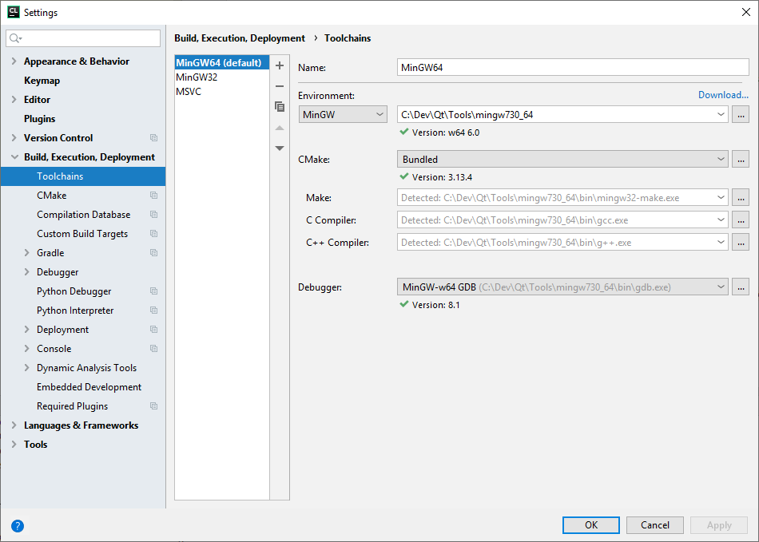

# QClockie

QClockie is a small digital clock widget with alarm and weather functionality. (Sorry for German as only language yet for the application. 
Internationalization is planned, English will be primary language in future releases. Design, esp. of the icons, is not final.)

Screenshot main application:\


Screenshot systray icon:\


Screenshot context menu:\


Screenshot application settings:\


## Vision 

I want to implement a convenient desktop clock with a simple and sleek design. Also it is planned to implement advances 
features like time announcement via text to speech, displaying the current weather, alarm, timer  
and stopwatch functionality. The clock is intended to be customizable regarding design and functionality and extendable 
by plugins that e.g. show the CPU/memory/disk usage.

### Planned functionality

* Internationalization (Different languages, date/time and temperature units)
* Platform-independent (at least Linux support)
* Displaying current and future weather using weather providers like [openweathermap.org](https://openweathermap.org/)
* Alarm
* Timer
* Stopwatch
* Time announcements via text-to-speech
* Customizable design
* Plugins delivering extended functionality 

## How to Build

### Windows (x64), MinGW 7.3, Qt 5.12

After checkout, set In CMakeList.txt setup CMAKE_PREFIX_PATH to directory containing Qt (e.g. ``C:\Dev\\Qt\5.12.2\mingw73_64\lib\cmake``)

#### IDE settings for CLion

Setup the Toolchain (_Settings > Build, Execution, Deployment > Toolchains_) according to the following screenshot:


Setup CMake (_Settings > Build, Execution, Deployment > CMake_) according to the following screenshot:\


Setup a Run configuration according to the following screenshot:


#### Assets and Libraries
Following files and directories need to be in the directory of the compiled exe file:
* Always
    * clock.ico
    * assets
        * fonts
        * img
        * sounds
* Windows
    * Debug
        * libgcc_s_dw2-1.dll
        * libstdc++-6.dll
        * libwinpthread-1.dll
        * Qt5Cored.dll
        * Qt5Guid.dll
        * Qt5Widgetsd.dll
        * platforms/qwindows.dll
    * Release
        * libgcc_s_dw2-1.dll
        * libstdc++-6.dll
        * libwinpthread-1.dll
        * Qt5Core.dll
        * Qt5Gui.dll
        * Qt5Network.dll
        * Qt5Widgets.dll
        * imageformats/*.dll
        * platforms/qwindows.dll

#### Deployment    
Run _windeployqt_ via cmd:
```
C:\Dev\\Qt\5.12.2\mingw73_64\bin\windeployqt.exe --dir C:\Dev\Git\QClockie\bin\Release --release
```

### Linux (x64)

Will follow soon. 